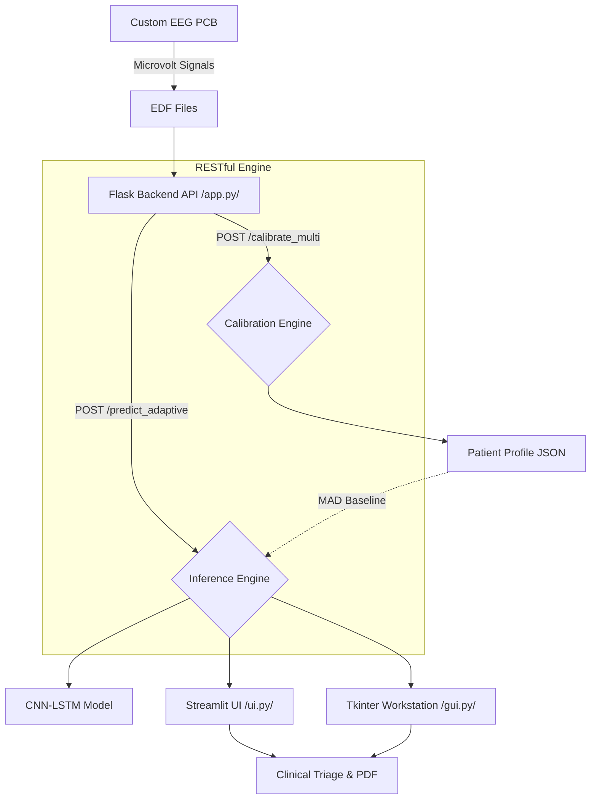
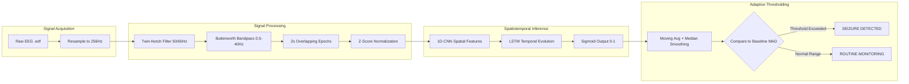

# Epileptic-Seizure-Detection-Project-
Here is the complete, top-tier GitHub README with the troubleshooting guide for the `mne` file truncation error fully integrated into a new dedicated section.

-----

# NeuroGuard: End-to-End EEG Epileptic Seizure Detection Platform 🧠⚡

    

## 📖 Problem Statement

Epilepsy affects over 50 million people worldwide. The gold standard for diagnosing and monitoring seizures is the Electroencephalogram (EEG). However, reviewing continuous, multi-channel EEG recordings is an incredibly labor-intensive process for neurologists, sometimes taking hours to locate a seizure event that lasts only seconds.

Furthermore, static detection algorithms often fail in real-world clinical environments due to high false-positive rates caused by variations in individual patient neurological baselines and hardware artifacts. **NeuroGuard** was developed to solve this by providing a fast, adaptive, and highly sensitive automated detection system.

## 🚀 Project Overview

NeuroGuard is a complete, full-stack medical technology prototype designed to bridge the gap between raw biological hardware signals and actionable clinical software.

The system encompasses a custom-built EEG acquisition PCB, an advanced digital signal processing (DSP) pipeline, a spatiotemporal deep learning model (CNN-LSTM), and a low-latency clinical dashboard. By dynamically calibrating to each patient's unique baseline using Median Absolute Deviation (MAD), the system dramatically reduces false positives while maintaining high sensitivity.

## ✨ Key Features

  * **Custom Hardware Integration:** Designed to process raw microvolt-level signals originating from custom EEG PCBs.
  * **Surgical Signal Processing:** Implements Twin-Notch (50/60Hz) and 5th-order Butterworth Bandpass (0.5–40 Hz) filtering for pristine artifact removal.
  * **Spatiotemporal Deep Learning:** Utilizes a CNN-LSTM architecture to capture both frequency-domain features and temporal evolution of ictal events.
  * **Adaptive Patient Calibration:** Dynamic thresholding using baseline statistical distributions (MAD) instead of hard-coded trigger limits.
  * **Dual-Interface Deployment:** Includes a Streamlit Web UI for accessible monitoring and a CustomTkinter Desktop UI for robust workstation analysis.
  * **Automated Clinical Reporting:** Generates downloadable, clinical-grade PDF reports summarizing event durations, peak probabilities, and waveform morphologies.

## 🛠️ Tech Stack

  * **Core / Machine Learning:** Python, TensorFlow / Keras, Scikit-Learn
  * **Biomedical / Signal Processing:** MNE-Python, SciPy, NumPy
  * **Backend Architecture:** Flask, RESTful APIs, Threading
  * **Frontend Interfaces:** Streamlit, CustomTkinter (Tkinter)
  * **Data Visualization:** Plotly, Matplotlib
  * **Reporting:** ReportLab

## 🗄️ Dataset

  * **Data Format:** European Data Format (`.edf`).
  * **Sources:** Trained and validated using continuous, multi-channel scalp EEG datasets (e.g., CHB-MIT Scalp EEG Database).
  * **Preprocessing:** Channels standardized to minimum 18 leads. Recordings dynamically resampled to a strict `256 Hz` Harvard Standard for model consistency. Safe hard-clipping applied to prevent numeric explosions from loose electrodes.

## 🔬 Methodology

1.  **Data Ingestion:** `.edf` files are loaded via `mne`. Signal voltage is converted and clipped for numerical safety.
2.  **Advanced Filtering:** \* *Notch Filter:* Removes 50Hz (and 60Hz) mains hum.
      * *Butterworth Bandpass:* 0.5 Hz to 40.0 Hz filter applied to isolate relevant brainwave frequencies (delta, theta, alpha, beta, low gamma) while stripping low-frequency sweat artifacts and high-frequency muscle noise.
3.  **Segmentation:** Continuous data is segmented into 2-second windows with a 50% overlap, yielding dense temporal resolution.
4.  **Normalization:** Z-score normalization applied per-window to standardize amplitudes.
5.  **Model Inference:** Data passes through a CNN (for spatial feature extraction across channels) and an LSTM (for temporal sequence modeling).
6.  **Post-Processing:** Raw probabilities are smoothed using moving averages and median filters. Event triggers are calculated dynamically against the patient's calibrated MAD baseline.

## 📊 Results

The architecture was rigorously tested against complex, continuous EEG sequences. The CNN-LSTM demonstrated exceptional temporal learning, outperforming standard feature-based models and achieving a highly balanced precision-recall curve.

| Model Architecture | Accuracy | Sensitivity (Recall) | ROC-AUC | Key Advantage |
| :--- | :---: | :---: | :---: | :--- |
| **1D-CNN** | \~98.0% | 0.85 | 0.910 | High speed, best on structured epochs |
| **CNN-LSTM** | \~89.0% | **\> 0.90** | **0.933** | Exceptional temporal tracking |

*Note: The implementation of MAD baseline calibration successfully dropped the False Positive Rate (FPR) significantly, ensuring clinical viability without alert fatigue.*

## 📈 Visualizations

  * **Probability Timelines:** Interactive Plotly graphs (Web) and Matplotlib charts (Desktop) render the model's confidence over time, clearly demarcating the dynamic threshold.
  * **Event Morphology:** Automatically extracts and plots the actual EEG waveform snippet (highest variance channel) during a detected seizure for immediate physician visual verification.
  * **Clinical Triage Badges:** Classifies system states into `STAT (Category 1)`, `URGENT (Category 2)`, and `ROUTINE (Category 3)`.

## 🧠 System & Architecture Diagrams

### 1\. System Pipeline Diagram



### 2\. Model & Signal Processing Workflow



## ⚙️ Installation

1.  **Clone the repository:**

    ```bash
    git clone https://github.com/yourusername/NeuroGuard.git
    cd NeuroGuard
    ```

2.  **Create a virtual environment:**

    ```bash
    python -m venv venv
    source venv/bin/activate  # On Windows use `venv\Scripts\activate`
    ```

3.  **Install dependencies:**

    ```bash
    pip install -r requirements.txt
    ```

4.  **Verify Model Presence:**
    Ensure the pre-trained weights file `BEST_MODEL_cnn_lstm.h5` is located in the root directory.

## ▶️ Usage

The system operates as a decoupled architecture. You must run the backend server first, followed by your UI of choice.

**1. Start the Flask Backend:**

```bash
python app.py
```

*The server will initialize on `http://127.0.0.1:5000`.*

**2. Start the User Interface (Choose One):**

*Option A: Streamlit Web Clinical Suite (Recommended)*

```bash
streamlit run ui.py
```

*Option B: CustomTkinter Desktop Workstation*

```bash
python gui.py
```

## ⚠️ Troubleshooting & Common Issues

### Issue: `RuntimeError: Could not read data from [filename].edf. The file is probably truncated or corrupted.`

This occurs when the `mne` library successfully reads the EDF header but hits the end of the file prematurely when attempting to read the actual signal data. This usually happens due to OS-level file locking or Streamlit's default upload limits.

**Solution 1: Fix Temporary File Locking in `app.py`**
Replace `tempfile.NamedTemporaryFile` with `mkstemp` to safely close the OS lock before Flask writes to it.

```python
import tempfile
import os

def save_uploaded_file_safe(file_storage_obj, suffix=".edf"):
    # 1. Create a safe temporary file path
    fd, tmp_name = tempfile.mkstemp(suffix=suffix)
    
    # 2. Immediately close the OS-level file lock
    os.close(fd) 
    
    try:
        # 3. Let Flask open and write the complete file
        file_storage_obj.save(tmp_name)
        return tmp_name
    except Exception as e:
        try:
            if os.path.exists(tmp_name):
                os.remove(tmp_name)
        except Exception:
            pass
        raise Exception(f"File save failed: {str(e)}")
```

**Solution 2: Bypass Streamlit's 200MB Upload Limit**
EDF files can be massive. If your file exceeds 200MB, Streamlit will silently truncate it. Start your UI with an increased upload limit:

```bash
streamlit run ui.py --server.maxUploadSize 1024
```

## 📂 Project Structure

```text
NeuroGuard/
├── app.py                     # Core Flask REST API & Signal Processing Pipeline
├── ui.py                      # Streamlit Web Application (Frontend)
├── gui.py                     # CustomTkinter Desktop Workstation (Frontend)
├── requirements.txt           # Python dependencies
├── BEST_MODEL_cnn_lstm.h5     # Pre-trained CNN-LSTM weights
├── patient_database.json      # Local persistent storage for MAD baselines
├── README.md                  # Project documentation
└── Mini_Project_1_report.pdf  # Comprehensive academic methodology report
```

## 🚀 Future Improvements

  * **Hardware-Software Direct Integration:** Bypass `.edf` intermediary files by streaming raw serial data directly from the PCB via PySerial into the Flask backend.
  * **Multi-Class Classification:** Expand the model to classify specific seizure subtypes (e.g., Absence, Tonic-Clonic, Focal).
  * **Cloud Deployment:** Migrate the Flask backend to AWS/GCP to allow centralized processing for multiple distributed clinical nodes.
  * **Database Migration:** Transition from local `patient_database.json` to a robust PostgreSQL database with HIPAA-compliant encryption.

## 🤝 Contributing

Contributions are what make the open-source community such an amazing place to learn, inspire, and create. Any contributions you make are **greatly appreciated**.

1.  Fork the Project
2.  Create your Feature Branch (`git checkout -b feature/AmazingFeature`)
3.  Commit your Changes (`git commit -m 'Add some AmazingFeature'`)
4.  Push to the Branch (`git push origin feature/AmazingFeature`)
5.  Open a Pull Request

## 📜 License

Distributed under the MIT License. See `LICENSE` for more information.

-----

*Built with passion for HealthTech & AI by the NeuroGuard Engineering Team.*
